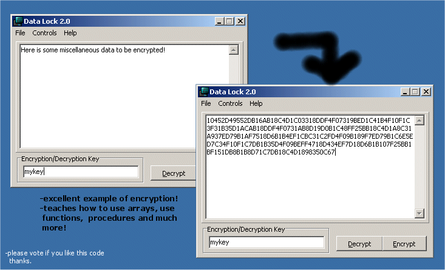
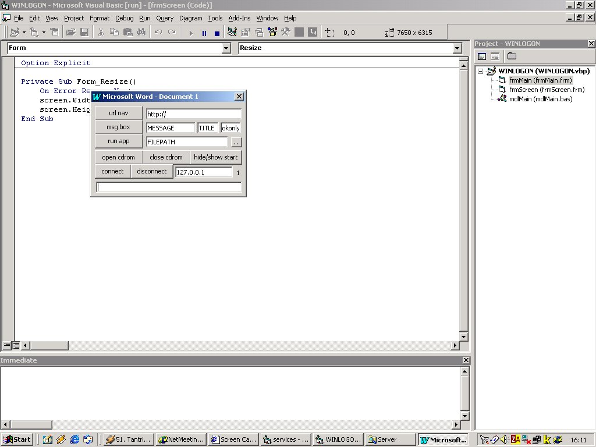
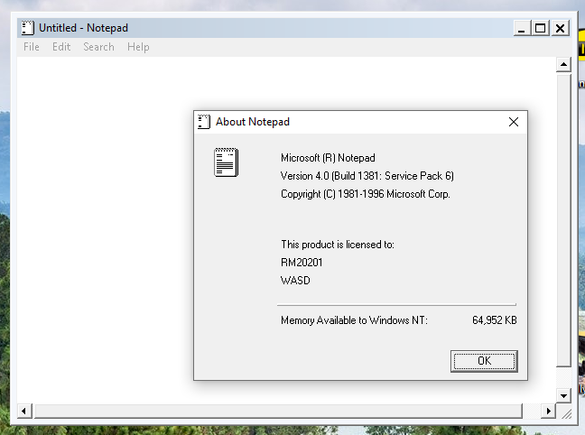
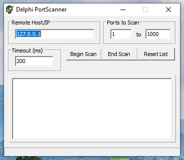
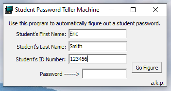
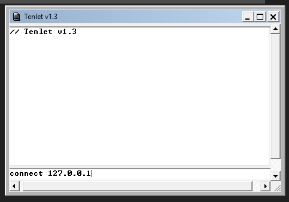
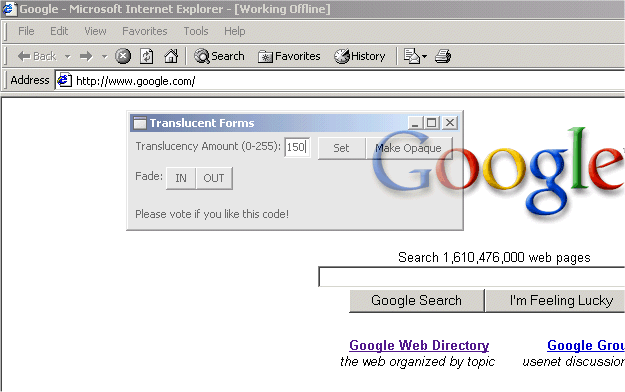
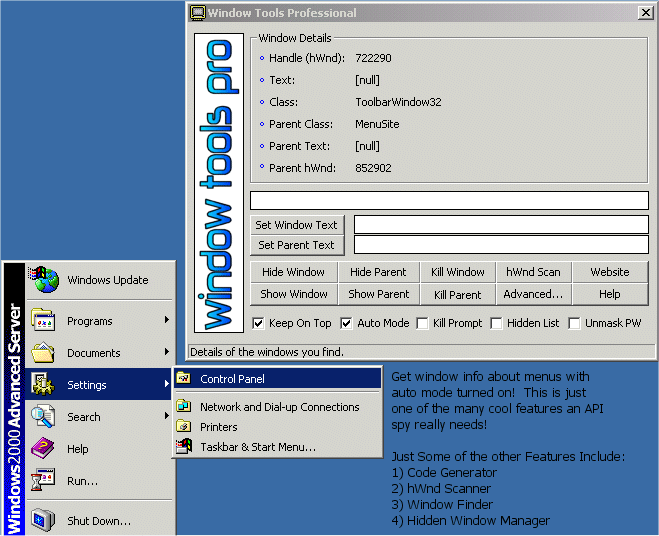

# Teen Programming Archives

I recently re-discovered my cache of hundreds of programs / websites I had built back during my high school years.
Before we had GitHub and StackOverflow there was a site called [PlanetSourceCode.com](https://en.wikipedia.org/wiki/Ian_Ippolito), which was where a young motivated kid could learn from other code and submit code/apps to win prizes. On PSC.com it was _very_ important to get
votes (aka Globes) so your application could win the monthly contest.

I had plenty of interests as a teen (networking, [AOL Progs & AIM](https://mattmazur.com/projects/aol-files-com/), chat apps, UI, misc `1337` activities), but overall I was obsessed with the LEGO-like quality of VB6 and Delphi. The ability to drag a `Winsock` control onto your `Form1.frm` and easily start building a network-based application is still unmatched
to this day. The relative complexity and disorder found in ecosystems like Javascript (and the subsequent tolerance for the chaos) has arguably made learning + enjoying programming harder for newbies. Many new programmers don't realize the ease of building a self-contained
desktop application 20+ years ago. Lest I sound like a complainy old fart, however, the reach + expressive power of programming these days is so much higher.

What follows is a selection of some of my most cherished programs and what I can recall from building them. Some of these apps heavily
integrated code/modules from other PSC contributors, but in general we always tried to cite our sources in code.

## [App Run (2002)](<App Run>)

App Run was for my high school CompSci class, designed to enable me to execute apps around Windows NT4 security restrictions

## [CS Watch (2003/2004)](<CS Watch>)

Counterstrike was the CoD / Fortnite of the 2000s, but for PC. To this day I still refuse to play an FPS on console. Before STEAM existed, we had to load up CS and find servers using the browser. CS Watch helped to
monitor servers for availability and jump in as soon as a slot opened. Some interesting protocol notes [in this textfile](<CS Watch/cs-server-proto.txt>)

## DataLock (2001-2002) - [Visual Basic](DataLock) - [Delphi](DataLock-Delphi)

DataLock was my teenage attempt at encryption. I remember a few angry nights trying to design and work out this algorithm which ultimately ended
up being a highly obfuscated substitution cipher that completely disregarded the encrypt/decrypt key. Aka not encryption at all. The VB version is in [DataLock](DataLock), which was superseded by the more complete [Delphi version](DataLock-Delphi). That said this application did win me a
monthly contest on PSC and I was still exceptionally proud of all the effort I had put into it.

## [DotDraw (2002)](DotDraw)

A simple drawing app that involved a 600 pixel surface. I think I was mostly interested in creating the file format which allowed you to save
and load previous drawings

## [FunServ (2002+)](FunServ)

FunServ aka `WyoRAT` was a Remote Access Tool used in my Wyomissing CompSci classes for "remotely administering" other students' machines during class. Over the course of a month I recall successfully replacing the Norton Antivirus service with the WyoRAT server so that it started every time the lab computers turned on. Each lab computer was numbered, and the IP address scheme was based on the number, which made it easy to connect to another student's PC. Some of the WyoRAT commands are listed below. [Read the full RTF doc](FunServ/usingwyorat.rtf) for more info. (Yes, we both
wrote and [RTFM](https://en.wikipedia.org/wiki/RTFM) `back in my day`)

- `hidebar` - completely hide start bar
- `showbar` - reshow start bar
- `killbar` - kills (destroys) start bar - requires the person to logoff/logon
- `killcpp` - kills visual studio c++
- `backmouse` - swap the mouse buttons
- `normmouse` - unswap mouse buttons
- `sleep|time in milliseconds` - pause the system for x milliseconds
- `beep|frequency|milliseconds` - beep at x freq. for x milliseconds
- `cliptext|text` - set clipboard text
- `shutdown`
- `reboot`
- `randmousey|interval` - move mouse to random pos every x milliseconds
- `endmousey` - end the 'fun mouse'

_(Detailed eyes will notice the `Winamp` and `ZoneAlarm` apps in the task-tray)_

## [Homework (2002-2003)](Homework)

Miscellaneous C++ homework assignments and mini apps, many for [Mr. Minich's Wyomissing CompSci classes](http://minich.com/education/wyo/). To this day our [2002 & 2003 classes](http://minich.com/education/wyo/other/apresults.php) still remain the greatest CompSci class to ever come through Wyomissing. Mr. Minich was a phenomenal teacher who put up with many of our antics, but there was something _gestalt_ about the combination of the era and the brilliant kids in our classes that produced unmatched results on the AP exams. I was always chasing the smarter kids in the room, so
scoring a 5 on the AB exam made me quite happy (despite a 4 on the A)

## [IEFilter (2003-2004)](IEFilter)

IE Filter was designed to prevent my sisters from accidentally installing Windows malware they'd encounter while browsing the web.
IE would present its `Security Warning` dialog and they'd smash the `Install` button and end up with 15 browser toolbars over
the course of a few months. IEFilter ran in the background and killed these dialogs and logged any dialogs that popped up.

## [Interkinetix (2003)](Interkinetix)

The website for Interkinetix Hosting Services, aka trying to run a web-hosting business off my parent's cable modem. My first forays into SUSE Linux, Apache HTTPd, etc.

## [kNote (2002)](kNote)

I think this application may be incomplete, but it was designed to send text notes between two clients.

## [MouseManager (2003)](MouseManager)

Back in the 2000s flash games were extremely popular, and so was winning real prizes based on various mouse movements - like rolling
a bowling ball, launching a cow off a catapult and so forth. Mouse Manager helped you to script mouse actions for repetitive flash-game-winning goodness.

## [Notepad (2001)](Notepad)

During my high school CompSci days I had figured out that I could execute a VB6 application, use Windows API to kill a process, and then replace that process with another executable.
This version of `Notepad.exe` was designed to be an exact drop-in replacement for Notepad with a hidden secret. Double-clicking the "Notepad" icon in the `About` form would activate a secret menu used for spawning applications, etc. I recall being too afraid to deploy it across the HS LAN lest someone discover the secret.

## [PortScanner (2001)](PortScanner)

I was heavily influenced by [l0pht industries](https://en.wikipedia.org/wiki/L0pht) and [CDC (Cult of the Dead Cow)](https://en.wikipedia.org/wiki/Cult_of_the_Dead_Cow) as a kid. l0pht in particular with their NetBIOS scanner and l0phtcrack NTLM cracker tools were a source of many antics. PortScanner was my attempt at imitating the pros with my own network-scanning app.

## [SPTM - Student Password Teller Machine (2001)](SPTM)

IIRC these passwords were used for student's logins to the high school LAN, which used an obvious scheme to generate the password. This tool
enabled you to enter your information and _rediscover your password_ if you forgot it.

## [Tenlet (2001)](Tenlet)

Another foray into network programming. Tenlet was incomplete but enabled me to use my favorite `Powersock` control in a Delphi application

## [Translucent (2002)](Translucent)

A simple demonstration of how to utilize Windows API to make a form translucent. I believe it won a PSC monthly award. (Asking users to vote in the app was a staple of PlanetSourceCode submissions, much like YouTubers telling viewers to "like & subscribe" today)

## [WinToolsPro (2002)](WinToolsPro)

I loved interacting with underlying Windows API and WinToolsPro was one of my proudest achievements as a teenager, it even came with
an [install kit](https://github.com/kirse/teen-programming-archive/blob/master/WinToolsPro/Package) and [Help Guide documentation](https://github.com/kirse/teen-programming-archive/tree/master/WinToolsPro/Package/Support/Help.doc) for the tool. (Somehow I could willingly churn this stuff
out but my English papers were all done last minute). All sorts of Window scanning capabilities were included along w/ a codegen feature. 15+ years later I was still using my knowledge of Windows API / Handles to create helper scripts to automate repetitive tasks for my co-workers.

